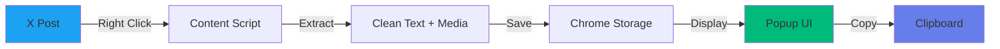

# Gripp

A lightweight Chrome extension that makes copying X (Twitter) posts actually useful.

 

---

## Why Gripp?

Copying X posts is broken. You lose formatting, structure, and context. Gripp fixes that.

**One right-click** → Perfect copy with:
- 📊 Word counts
- 📏 Clean formatting  
- 📸 Media tracking
- 🎨 Smart organization

Perfect for feeding content to AI tools, research, or archival.

---

## Features

### Smart Badges
- **Word Count** - See content length instantly
- **Color Coding** - Green for articles, blue for tweets
- **Media Detection** - Track images and videos

### Clean UX
- **One-Click Copy** - Right-click or keyboard shortcut
- **History** - Last 50 copies saved
- **Themes** - Dark/Light mode
- **Fast** - <50KB, instant loading

---

## Installation

### Quick Install (30 seconds)

1. **Download** - Click green "Code" button → "Download ZIP"
2. **Extract** - Unzip the downloaded file
3. **Load in Chrome**:
   - Go to `chrome://extensions`
   - Enable "Developer mode" (top right)
   - Click "Load unpacked"
   - Select the extracted folder
4. **Done!** - Icon appears in toolbar

### Usage

**Copy a post:**
- Right-click on any X post → "Copy full post with Gripp"
- Or use keyboard: `Ctrl+Shift+G`

**View history:**
- Click Gripp icon in toolbar
- Click any item to copy again
- Click "View Tweet" to open original

---

## How It Works



### Architecture

```
┌─────────────────────────────────────────┐
│           X (Twitter) Page              │
│                                         │
│  ┌─────────────────────────────────┐   │
│  │     Content Script              │   │
│  │  • Detects articles/tweets      │   │
│  │  • Extracts text & structure    │   │
│  │  • Counts words & media         │   │
│  └─────────────┬───────────────────┘   │
└────────────────┼───────────────────────┘
                 │
                 ▼
        ┌────────────────────┐
        │  Background Worker │
        │  • Context menu    │
        │  • Keyboard events │
        └────────┬───────────┘
                 │
                 ▼
        ┌────────────────────┐
        │  Chrome Storage    │
        │  • History (50)    │
        │  • Settings        │
        │  • Theme           │
        └────────┬───────────┘
                 │
                 ▼
        ┌────────────────────┐
        │    Popup UI        │
        │  • History cards   │
        │  • Word badges     │
        │  • Copy button     │
        └────────────────────┘
```

### Data Flow

1. **User Action** → Right-click or shortcut
2. **Extract** → Content script reads X post structure
3. **Process** → Count words, detect media, classify type
4. **Store** → Save to Chrome local storage (max 50 items)
5. **Display** → Show in popup with badges and formatting
6. **Copy** → One-click to clipboard

---

## Output Format

```
Author: Display Name @handle  📷 3 images
---

heading: Article Title

Article content with proper formatting...

• Bullet points preserved
• Structure maintained

[Image1]
> Quotes included

[Video1]
```

**Note:** The `---` displays as a full-width line in the UI.

---

## Privacy

✅ **100% Local** - No servers, no tracking, no analytics  
✅ **Offline** - Works without internet  
✅ **Your Data** - Everything stays on your device

**Permissions Used:**
- `contextMenus` - Right-click menu
- `storage` - Save history
- `clipboardWrite` - Copy to clipboard
- `activeTab` - Read X posts

---

## FAQ

**Q: Does it work on Twitter.com?**  
A: Yes! Works on both twitter.com and x.com

**Q: How many items can I save?**  
A: 50 most recent copies (configurable in code)

**Q: Can I export my history?**  
A: Not yet - coming in v2.1 (Markdown export)

**Q: Does it send my data anywhere?**  
A: No. Everything is local. Zero network requests.

**Q: Chrome Web Store?**  
A: Not submitted yet. Install from GitHub for now.

---

## Changelog

**v2.0.0** (2026-02-02) - Major UI Update
- Added word count badges
- Dynamic responsive separators  
- Smart color coding
- Accurate word counting

**v1.0.0** (2026-01-19) - Initial Release
- Core extraction
- History management
- Themes

[Full Changelog →](CHANGELOG.md)

---

## Contributing

Found a bug? Want a feature? [Open an issue](https://github.com/vabhinavrao/gripp/issues)

---

## License

MIT License - Free to use, modify, and distribute.

See [LICENSE](LICENSE) file for details.

---

**Made with ❤️ for the X community**

[⭐ Star on GitHub](https://github.com/vabhinavrao/gripp) • [🐛 Report Bug](https://github.com/vabhinavrao/gripp/issues) • [💡 Request Feature](https://github.com/vabhinavrao/gripp/issues)
